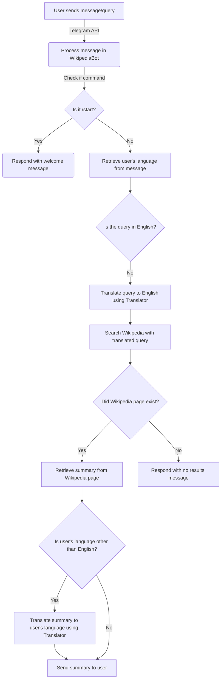

# Wikipedia Telegram Bot

This Python script implements a Telegram bot that leverages the Wikipedia API to provide information in response to user queries. The bot is capable of handling queries in multiple languages, and it uses Google Translate to translate search results back to the user's language.

## Getting Started

### Prerequisites

Before running the script, you need to have the following installed:

- Python 3
- pip (Python package installer)

Install the required Python packages using the following command:

```bash
pip install python-telegram-bot wikipedia-api requests
```

### Configuration

Replace `'YOUR_TELEGRAM_BOT_TOKEN'` in the script with your actual Telegram bot token.

```python
if __name__ == '__main__':
    bot_token = 'YOUR_TELEGRAM_BOT_TOKEN'
    wiki_bot = WikipediaBot(bot_token)
    wiki_bot.run()
```

## Usage

1. Start a conversation with the bot on Telegram by searching for it and clicking on "Start."
2. Send a message to the bot with your query or use the `/start` command to initiate a conversation.
3. The bot will respond with information retrieved from Wikipedia. If no results are found, it will notify you.

## Features

- **Multilingual Support:** The bot can understand queries in different languages.
- **Google Translate Integration:** Results are translated back to the user's language for a more personalized experience.
- **Command Handling:** The bot responds to the `/start` command to provide a welcome message.

## Customization

- Adjust the `self.user_agent` variable in the `WikipediaBot` class if needed.
- Modify the character limit in `summary = page.summary[0:5000]` to control the length of the response.

## Flowchart



## License

This project is licensed under the MIT License - see the [LICENSE](LICENSE) file for details.

## Acknowledgments

- [python-telegram-bot](https://python-telegram-bot.readthedocs.io/) library for Telegram bot development.
- [wikipedia-api](https://github.com/RichardLitt/wikipedia-api) library for interfacing with the Wikipedia API.
- [Google Translate](https://cloud.google.com/translate/docs) for language translation services.
- Thanks to the developers of the used libraries and services.

### Support

You can support me by buy me a coffee if u like to.
<div align="left">
<!--   <h4>And you can also support me by <a href="https://www.buymeacoffee.com/azzar" target="_blank">buying me coffee</a></h4> -->
  <a href="https://www.buymeacoffee.com/azzar" target="_blank">
    
  </a>
</div>
