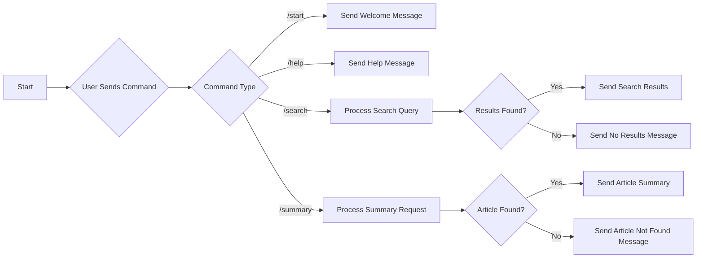

# wikipedia-powered-telegram-bot

[](https://www.codefactor.io/repository/github/1999azzar/wikipedia-powered-telegram-bot)

This chatbot is designed to provide information from Wikipedia based on user queries. It is implemented using the Telegram Bot API and utilizes the Wikipedia API to fetch search results and article summaries.

## Folder Structure

The folder structure of the chatbot project is as follows:

```
bot/
  ├── wikipedia_helper.py
  ├── telegram_helper.py
  ├── main.py
.env
README.md
requirements.txt
```

- `bot/`: Contains the helper modules for Wikipedia and Telegram integration.
  - `wikipedia_helper.py`: Provides functions to interact with the Wikipedia API to search for articles and retrieve summaries.
  - `telegram_helper.py`: Defines the Telegram bot commands and handles user interactions.
- `main.py`: The main script that sets up the Telegram bot and handles message routing.
- `README.md`: The global README file (you are reading it now!).
- `requirements.txt`: Contains the required Python packages and their versions.

## Prerequisites

To run the chatbot, ensure you have the following:

- Python 3.x installed on your system.
- Access to the internet to make API requests.
- Telegram bot token. You can obtain this by creating a bot on the Telegram BotFather platform.

## Installation

1. Clone the repository to your local machine or download the source code.
2. Install the required dependencies by running `pip install -r requirements.txt` in the project directory.
3. Set up environment variables:
   - Create a `.env` file in the project directory.
   - Add the following variables to the `.env` file:
     ```
      # Your Telegram bot token obtained using @BotFather
      TELEGRAM_BOT_TOKEN="telegram_bot_token" #telegram bot token
      WIKIPEDIA_LANGUAGE="en" #wikipedia language
     ```
     Replace `<your_bard_token>` with the token for your Bard chatbot and `<your_telegram_bot_token>` with the token for your Telegram bot. `<your_user_id>` should be replaced with your Telegram user ID.
4. Run the chatbot by executing `python bot/main.py`.


## Configuration

1. Open the `.env` file in the project root directory.
2. Replace `YOUR_TELEGRAM_BOT_TOKEN` with your Telegram bot token obtained from BotFather.

## Usage

1. Run the chatbot by executing the following command:

   ```
   python main.py
   ```

2. Open the Telegram app and search for your bot using the bot's username.
3. Start a conversation with the bot by sending the `/start` command.
4. Use the available commands to interact with the bot and search for Wikipedia articles.

## Available Commands

- `/start`: Start a conversation with the bot and get a welcome message.
- `/help`: View the available commands.
- `/search <query>`: Search for articles on Wikipedia based on a query.
- `/summary <title>`: Get a summary of a Wikipedia article based on the article title.

## Flowchart



## Contributing

Contributions to this chatbot project are welcome! If you have any suggestions, bug reports, or feature requests, please open an issue or submit a pull request.

### Support

You can support me by buy me a coffee if u like to.
<div align="left">
<!--   <h4>And you can also support me by <a href="https://www.buymeacoffee.com/azzar" target="_blank">buying me coffee</a></h4> -->
  <a href="https://www.buymeacoffee.com/azzar" target="_blank">
    
  </a>
</div>
